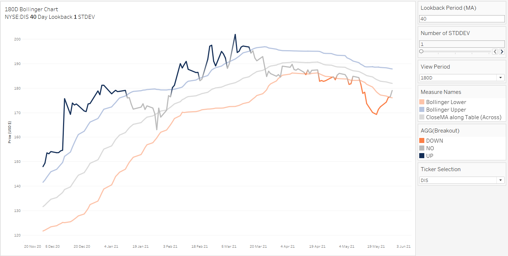
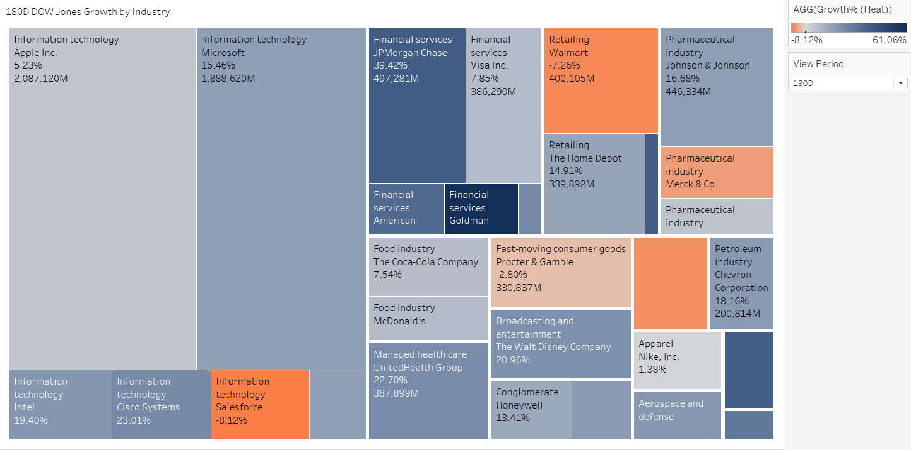
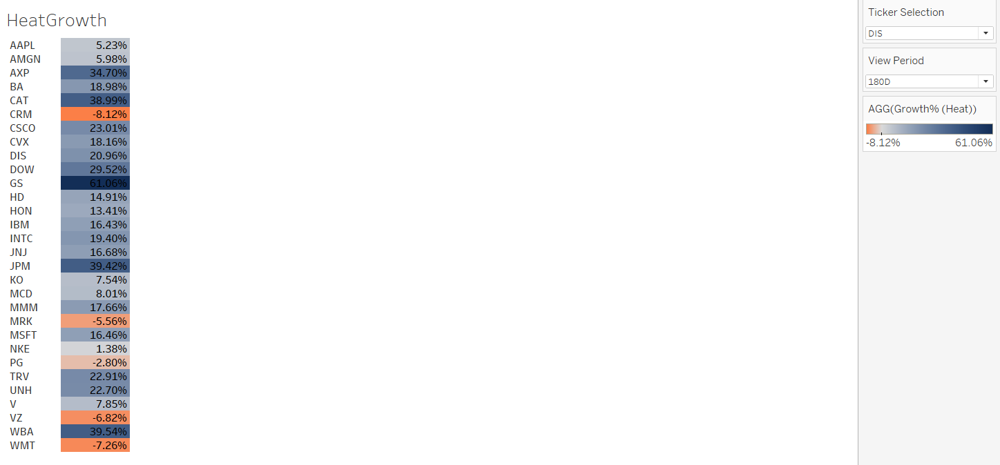

# 📊 Tableau Trading Dashboard: US Stocks Analysis  
**A Business Intelligence Case Study for an Investment Bank**  

 
 
  

---

## 🌟 **Overview**  
This project is a dynamic **Trading Dashboard** designed for an investment bank to analyze and trade US stocks efficiently. Built using **Tableau**, it integrates advanced analytics, interactive visualizations, and real-time data insights. The dashboard enables traders to monitor price movements, volatility, sector performance, and technical indicators like Bollinger Bands.  

**Key Tools & Technologies**:  
- **Data Transformation**: SQL, Azure Data Studio  
- **Visualization**: Tableau (LODs, Table Calculations, Parameters)  
- **Data Modeling**: Star Schema, ERD Diagrams  

**Preview of Dashboard**:  
  
<!--  -->

**[Access Live Dashboard](https://public.tableau.com/views/TradingDashboard_17406427752560/TradingDashboard?:language=en-US&:sid=&:redirect=auth&:display_count=n&:origin=viz_share_link)**  

---

## 🎯 **Objectives**  
1. Provide **real-time insights** into stock performance for traders.  
2. Enable dynamic exploration of technical indicators (e.g., Bollinger Bands, Volume Profiles).  
3. Visualize sector-wise growth trends using interactive **Heatmaps** and **Treemaps**.  
4. Demonstrate end-to-end BI capabilities: **ETL → Data Modeling → Visualization**.  

---

## 📈 **Dashboard Features**  

### **Interactive Visualizations**  
| Feature | Description | Icon |  
|---------|-------------|------|  
| **Candlestick Chart** | Track price movements (Open, High, Low, Close) with a 40-day lookback. | 📉 |  
| **Bollinger Bands** | Analyze volatility with 1 STDDEV bands and moving averages. | 📊 |  
| **Volume Profile** | Visualize trading volume distribution across price levels. | 🔍 |  
| **Relative Growth Chart** | Compare DIS vs. Dow Jones performance over 180 days. | 📈 |  
| **HeatGrowth Table** | Color-coded growth % across stocks (e.g., CAT: +38.99%, CRM: -8.12%). | 🔥 |  
| **Treemap by Industry** | Sector-weighted growth visualization (e.g., Financial Services: +39.42%). | 🗺️ |  

### **Dynamic Interactions**  
- Toggle between **Candlestick Chart** and **Treemap** with a button.  
- Adjust lookback periods, STDDEV values, and view timelines.  
- Filter by ticker (e.g., DIS, AAPL, JPM).  

---

## 🛠️ **Technical Details**  

### **Data Pipeline**  
1. **Source**: Excel files containing daily stock prices and metadata.  
2. **Transformation**:  
   - Cleaned and modeled data using **SQL** in **Azure Data Studio**.  
   - Created views for fact tables (`FactPrices_Daily`, `FactAttributes_Intraday`) and dimensions (`DimSecurity`, `DimExchange`).  
3. **ERD Diagram**:  
   

4. **Tableau Analytics**:  
   - Used **LODs** for rolling averages and Bollinger Band calculations.  
   - Applied **Table Calculations** for growth % and relative price changes.  

---

<!-- ## 📸 **Screenshots**  

| Visualization | Preview |  
|---------------|---------|  
| **Candlestick + Bollinger Bands** |  |  
| **Treemap by Industry** |  |  
| **HeatGrowth Table** |  |  -->

---

## 🚀 **How to Use**  
1. **Access the Dashboard**:  
   - Open the [Tableau Public Link](https://public.tableau.com/views/TradingDashboard_17406427752560/TradingDashboard?:language=en-US&:sid=&:redirect=auth&:display_count=n&:origin=viz_share_link).  
   - Use filters (Ticker, View Period) and click interactive elements (e.g., buttons, legends).  
2. **Key Interactions**:  
   - Click the **"Treemap"** button to switch from Candlestick view.  
   - Hover over charts to view tooltips (e.g., Bollinger Upper/Lower values).  
   - Adjust the **Lookback Period** and **STDDEV** for Bollinger Bands.  

---

## ✅ **Conclusion**  
This dashboard empowers traders with actionable insights through:  
- **Real-time analytics** for decision-making.  
- **Multi-perspective views** (technical, sectoral, volumetric).  
- **Scalable data architecture** (SQL + Tableau integration).  

**Future Enhancements**:  
- Integrate live API data feeds.  
- Add machine learning-driven forecasts.  

---

